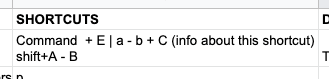
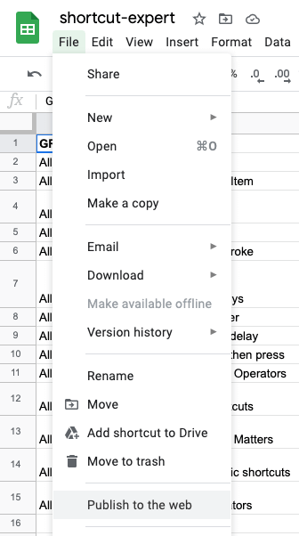
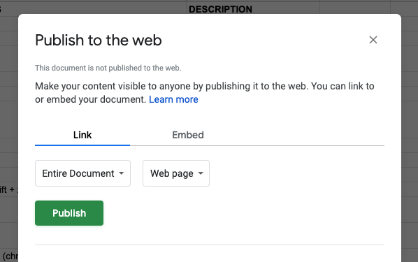
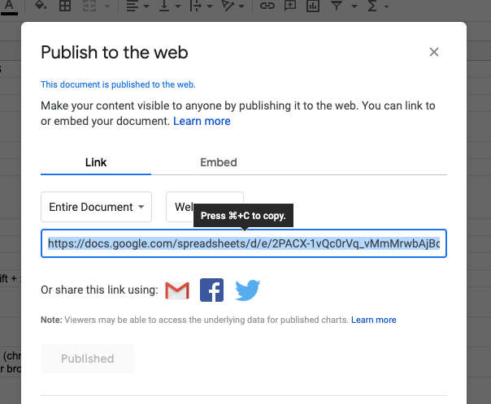
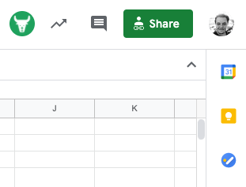
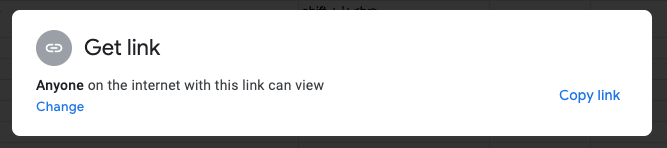
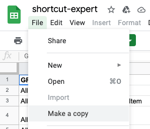

<p align="center"></p>
<h1 align="center">Shortcut Expert</h1>
<p align="center">Shortcut Expert is a platform for all application shortcuts.</p>
<p align="center">
  
  
  
  <a href="https://github.com/giray123/shortcutexpert/issues"></a>
<a href="https://twitter.com/intent/tweet?text=Wow:&url=https%3A%2F%2Fgithub.com%2Fgiray123%2Fshortcutexpert"></a>
</p>

## :heart:&nbsp; Purpose

- :package:&nbsp; Gather all application shortcuts into a single platform
- :blush:&nbsp; Provide best user experience for application shortcuts
- :necktie:&nbsp; Create universal shortcut standarts
- :globe_with_meridians:&nbsp; Make it super accessable worldwide

## :hammer:&nbsp; Technologies

Shortcut Expert is build with <a href="https://vuejs.org/">VueJS</a>, <a href="https://gridsome.org/">Gridsome</a> and <a href="https://vuetifyjs.com/en/">Vuetify</a>.

It is served with [Netlify](https://www.netlify.com/), and it is statically generated, which means that every page is SEO friendly and distributed through a CDN. This process makes the pages very fast to load and discoverable for users.

There is no database; once you fork it, you have all the data necessary to run it locally(including the application shortcuts).

## :gift:&nbsp; How It Works ?

All application data is in `src/data/applications`. Each file has everything necessary for a specific application. Although JSON files can be manually created / edited, there is an easier way, which is preferred and more error-free. You can prepare JSON files using Google Sheets! Shortcut Expert can fetch data from your Google Sheets file to prepare the application data.

## Google Sheet Files

You need to follow some standarts as you prepare your Google Sheets file.

### Sheets (Tabs)

You need to create a different sheet (tab) for each operating system. Available options are: `macos` and `windows` for now. More will come in the future.

### Tables

Each sheet (tab) needs to have 4 columns as the below example. You can also check this [example Google Sheets file](https://docs.google.com/spreadsheets/d/1xGfSrETQto0kA-FGxeooDb08nuwHcO_THZ8H0DcyCQE/edit#gid=1240391001).

| group   | name | shortcuts | description             |
| ------- | ---- | --------- | ----------------------- |
| editing | copy | ctrl + c  | copy text for later use |
| ...     | ...  | ...       | ...                     |

Note that column names are case insensitive

Column Descriptinos:

- group: we use to group the shortcuts
- name: short name for the shortcut
- shortcuts: Special text to represent timely shortcuts. More info below
- description: details / descriptions for the shortcut

Shortcuts has a special syntax. Below is a complex example:

<p align="center"></p>

Special Operators (you need to type the symbol not the text):

| Operator | Description                     |
| -------- | ------------------------------- |
| Plus (+) | Press Together                  |
| Dash (-) | Press after a delay             |
| Plus (+) | Release and press after a delay |

Other things to consider for Shortcuts cells:

- Capitalization matters: `a` and `A` will be displayed differently on Shortcut Expert. Test them out.
- Spaces are not important
- You can add multiple shortcuts for a line, just use a new line for each. You can add a new line to any cell by `option + enter` in Google Sheets
- You can add a tooltip to any shortcut by adding a text between paranthesis at the end of each line.

### Access

In order for Shortcut Expert to fetch data from your Google Sheets file you need to make your file **published to the web** and **public**. Other users will be able to see your table and copy it if they want to make an edit. Here are the steps to make a file **published** and **public**:

Click on `File > Publish to the web`

<p align="center"></p>

Click on `Publish` (options are not important)

<p align="center"></p>

Beware that once published the link on the same window is not the one we will use to fetch the data. So, you can close that window.

<p align="center"></p>

Click on `Share` button.

<p align="center"></p>

Make your file `Anyone on the internet with this link can view`. And click on `Copy link`. We will use this link to fetch data into Shortcut Expert.

<p align="center"></p>

### Test Your Google Sheet File

After you prepare your Google Sheets file, you can use our <a href="https://shortcutexpert.com/shortcuts/test-application">Test Application Page</a> to test it out.

Once it is ready, use <a href="https://shortcutexpert.com/prepare-application">Prepare Application Page</a> to prepare a json file for your application. You need to add several other meta data such as name, logo etc. all of which is explained on that page.

### Create a Pull Request

If you are adding a new application download your JSON file from <a href="https://shortcutexpert.com/prepare-application">Prepare Application Page</a> into `src/data/applications` and create a pull request.

If you are editing an existing application copy-paste the JSON content into the existing application file in `src/data/applications` and create a pull request.

### Note on Updating Existing Applications

When you open an application page on Shortcut Expert, you will see an EDIT button just below the title. Once clicked, you will be directed to the [Prepare Application Page](https://shortcutexpert.com/prepare-application) filled with the existing application data.

There you can find the Google Sheets file URL which was used to create that application. Once you go to that Google Sheets file, you can not edit that file since you do not own it. However, you can copy that Google Sheet to your own drive by `File > Make a copy`.

<p align="center"></p>

Again, you can use [Test Application Page](https://shortcutexpert.com/shortcuts/test-application) to test the shortcuts after your edits and [Prepare Application Page](https://shortcutexpert.com/prepare-application) to prepare a JSON file and create a pull request for your updates.

### Add a keyboard layout

Coming soon...

## :eyes:&nbsp; Running Locally

Prepare the project

```shell
git clone https://github.com/giray123/shortcutexpert.git
cd shortcutexpert
npm i
```

Run development mode

```shell
npm run develop
```

Build the static site

```shell
npm run build
```

Build command prepares the static website into `dist` folder. You do not need to build it before any pull requests. We build the application on the cloud.

## :moneybag:&nbsp; Donate

Coming soon...

## :bookmark:&nbsp; License

You can contribute to this repo, however, you can not use any variant for commercial purposes.
