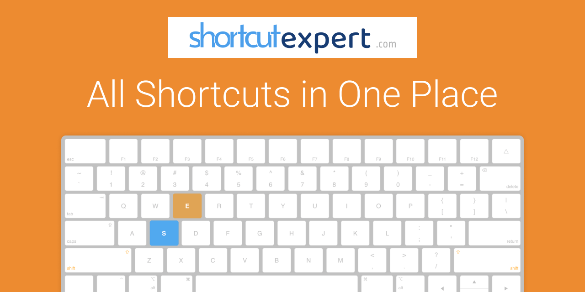

<h1 align="center">Shortcut Expert</h1>

Shortcut Expert is a platform for all application shortcuts.

  
  
  
  

## :heart:&nbsp; Purpose

- :package:&nbsp; Gather all application shortcuts into a single platform
- :blush:&nbsp; Provide best user experience for application shortcuts
- :necktie:&nbsp; Create universal shortcut standarts
- :globe_with_meridians:&nbsp; Make it super accessable worldwide

## :hammer:&nbsp; Technologies

Shortcut Expert is build with <a href="https://vuejs.org/">VueJS</a>, <a href="https://gridsome.org/">Gridsome</a> and <a href="https://vuetifyjs.com/en/">Vuetify</a>.

It is served with [Netlify](https://www.netlify.com/) and it is statically generated, which means that every page is SEO friendly and distributed through a CDN. This process makes the pages very fast to load and discovereable for users.

There is no database, once you fork it, you have all the data necessary to run it locally(including the application shortcuts).

## :gift:&nbsp; Contribution

You can fork the GitHub repo and create pull requests for anything. However, below are some common contributions:

### Add a new application

All application data is in `src/data/applications`. Each `json` file represents an application. You need to prepare a `json` file for your application and create a pull request.

Preparing a `json` file for your application is pretty stratight forward. Although, you can prepare your `json` file manually, here is to prepare it very easily:

#### 1. Prepare a Google Sheets File

First, create a Google Sheets file and prepare it as in <a href="https://docs.google.com/spreadsheets/u/2/d/1xGfSrETQto0kA-FGxeooDb08nuwHcO_THZ8H0DcyCQE/edit#gid=1240391001">this example</a>. You need to create a different sheet (tab) for each operating system and each tab needs to have below columns.

| group   | name | shortcuts | desciption              |
| ------- | ---- | --------- | ----------------------- |
| editing | copy | ctrl + c  | copy text for later use |
| ...     | ...  | ...       | ...                     |

#### 2. Test your application shortcuts

After you prepare your Google Sheets file, you can use our <a href="https://shortcutexpert.com/shortcuts/test-application">Test Application Page</a> to test it out.

Once it is ready, use <a href="https://shortcutexpert.com/create-application">Create Application Page</a> to prepare a json file. Details for each field is explained on the page.

#### 3. Create a JSON file and request a pull

Afterward, download your json file and create a pull request to add your application to `src/data/applications`. Once the pull request is merged by repo admins, our server will generate a static page for the application and distribute it worldwide through Netlify CDN.

### Update an existing application

Each application has a Google Sheet URL in its json file (additionally there is a link pointing to that file on each application page). Once you go to the URL, you can not edit that file since you do not have permissions. However, you can copy that Google Sheet to your own drive. After you copy, make the necessary updates and make sure that you publish your Google Sheet. Once you publish it, click the share button and make your file accessable for anyone on the web (so that Shortcut Expert can fetch data from your Google Sheet file).

Again, you can use [Test Application Page](https://shortcutexpert.com/shortcuts/test-application) to test the sohrtcuts and [Create Application Page](https://shortcutexpert.com/create-application) to prepare a json file and create a pull request for your updates. Because you are editing an existing application, make sure the name of the `json` file is same with the original application file.

Again, without preparing a Google Sheets file, you can manually edit the original `json` file in `src/data/applications` and create a pull request after your edit.

### Add a keyboard layout

Coming soon...

## :eyes:&nbsp; Running Locally

Prepare the project

`git clone https://github.com/giray123/shortcutexpert.git cd shortcutexpert npm i`

Run development mode

`npm run develop`

Build the static site

`npm run build`

Build command prepares the static website into `dist` folder. You do not need to build it before any pull requests. We build the application on the cloud.

## :moneybag:&nbsp; Donate

Coming soon...

## :bookmark:&nbsp; License

You can contribute to this repo, however you can not use any variant for commercial purposes.
